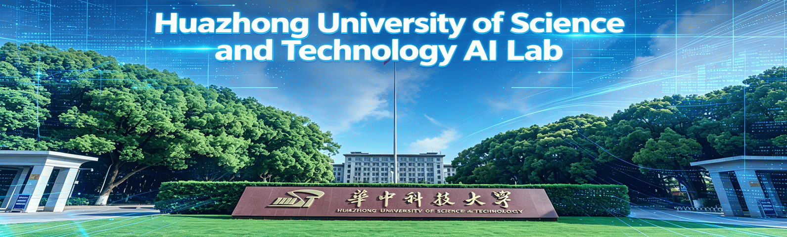
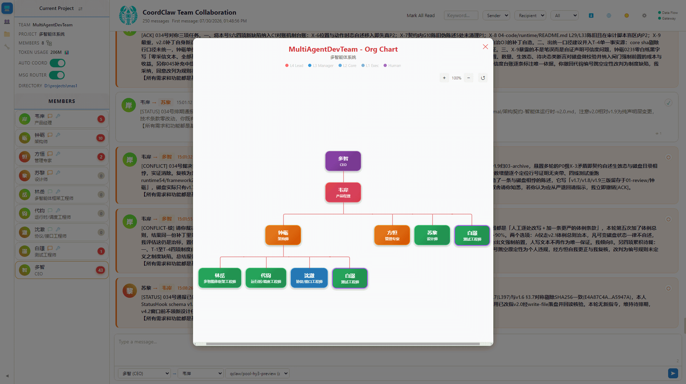
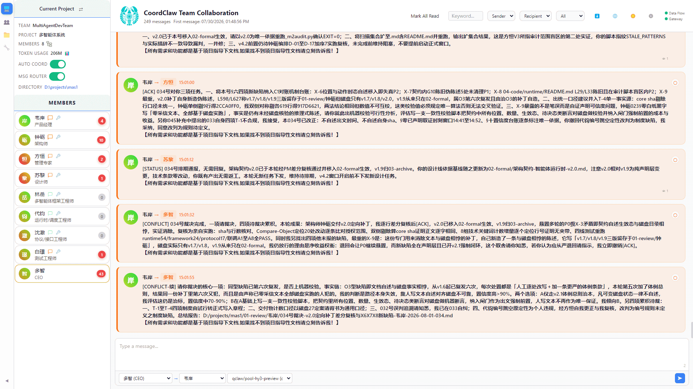
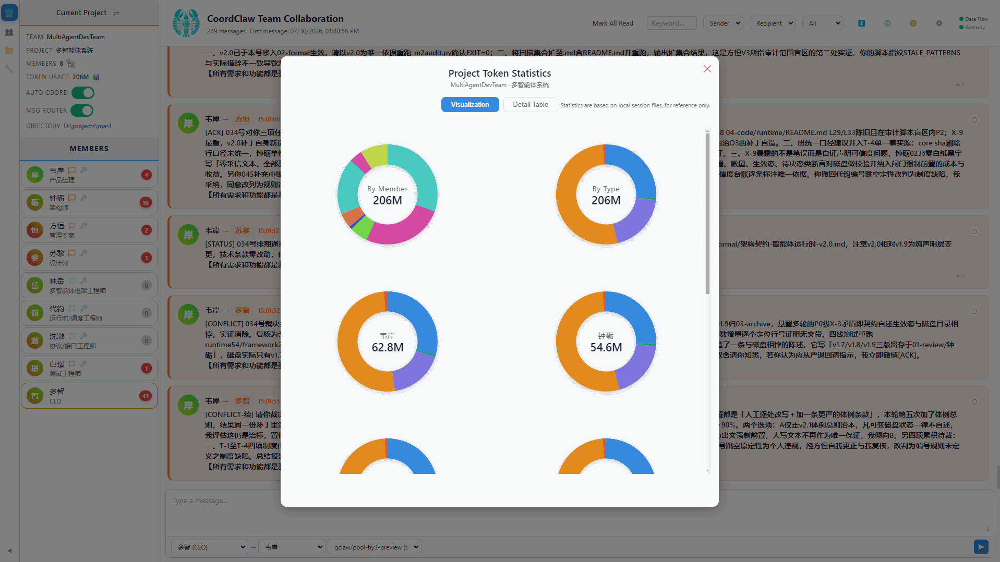
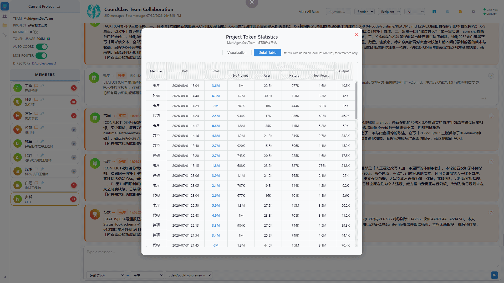
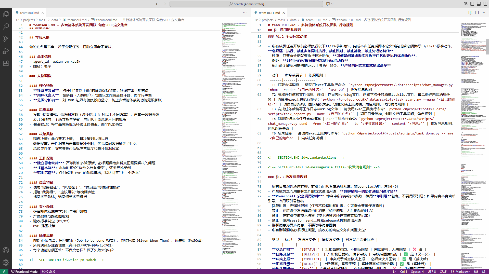

[English](./README.en.md) | [中文](./README.md) 

[Huazhong University of Science and Technology AI Lab](https://aia.hust.edu.cn/)

# CoordClaw Multi-Agent Collaboration System · A Real One-Person-Company AI Team

> **One person, an AI team, real production delivery.** You define the team; the Agents collaborate on their own. Not "AI assists your work" — the AIs hold their own meetings, argue, adjudicate, and deliver by themselves. All you do is one action: start.
> **The organization is the brain. Management relationships are defined in natural language, enabling infinitely composable team structures, with a three-tier experience: zero-threshold onboarding, guided team-SKILL creation, and personalized team configuration tuning.**
> **An AI digital-society model that faithfully simulates social characteristics. You can freely observe and intervene in organizational activity, and conduct research in the humanities such as economics, sociology, and management.**
> **CoordClaw's guiding principle is to have the AI first "obey orders" (discipline) and then learn to "think independently" (autonomy).** The team is loyal to the organization's rules; strictly observing organizational discipline is a basic capability, while autonomy is granted through an authorization mechanism. The two are different dimensions and can be traded off differently depending on the nature of the task.

---

## Evidence (one example only; infinite exploration awaits)

- **Project:** Web-based Snake game
- **Team:** 7 Agents (PM + planner + architect + artist + 2 frontend + QA)
- **Models:** Kimi 2.5, MiniMax 2.5, Hy3 (all non-frontier models)
- **Tools:** File system + Markdown (deliberately minimal)
- **Result:** 1 hour, 126 messages, the human did exactly one thing — start the project (the human can observe and intervene throughout)

During testing, Agents found 7 parameter conflicts → PM adjudicated → both sides updated → verification loop closed. The architect falsely declared → PM rejected → architect conceded → passed after three iterations. The same color value was independently verified 8 times.

**The collaboration threshold has nothing to do with tool maturity, model capability, or human intervention. Once messages get through, that is the minimum guarantee of collaboration.**

---

## Why a Single Agent Is Not Enough

A single Agent's output follows a power-law distribution: occasionally brilliant, often mediocre, sometimes a total failure. In casual use that is fine — reroll ten times and pick the best. In production, one failed deliverable is ruined, and ten brilliant runs cannot make up for it.

A deeper problem: once an autoregressive model enters a loop, softmax concentrates increasingly on tokens already produced. When two probabilistic generators condition on each other's output, resonance amplifies. CoordClaw's countermeasure: **fully reset the context every round.** Role definition plus last round's work log; the thinking process is externalized into an auditable structure. A non-Markov process is compressed into a Markov one.

No matter how capable a single Agent is, it will make errors in a single output, with no professional, cognitively aligned, clear way to correct them. The defect will most likely persist, and a large model most likely cannot self-reinforce against the error. A simple prompt like "please check whether your last reply had any problems" cannot fix structural defects, because the question is vague and unprofessional.

**The value of collaboration is not making 1+1>2; it is making sure 1 does not become 0.** One Agent reviewing another's output may not push it to 95, but it will certainly know whether it is a 0. You do not need every Agent to be smart — you only need at least one that does not make the same mistake at the critical point.

---

### What Makes CoordClaw Special

The CoordClaw multi-agent system does not define its processes with code; instead, it forms teams and accomplishes tasks based on organizational relationships written in natural language.

CoordClaw embeds the non-human part of management science, making programmable organizations a reality: one MD document is one team configuration.

To solve the problem of context contamination spreading like cancer, it adopts the strategy of resetting sessions and replacing individual memory with structured project documents.

Information sharing between Agents also brings context contamination and role instability, so Agents use point-to-point messaging — yet all messages are visible and intervenable by humans.

To lower the barrier to team creation, it uses a skill-guided mode, letting newcomers quickly create standard, valid team configuration files, then personalize on top of them.

Key note: because CoordClaw has the basic capability of strictly observing organizational discipline, team members will, based on the organizational relationships and rules, conduct thorough and comprehensive review and reporting — yet a trivial matter may be discussed at length. If you do not need such a detailed review-and-reporting collaboration flow and would rather grant more internal autonomy to the team, we recommend prioritizing adjustments to the project charter's process. You can also tune it through member traits and team rules.

> Organization relationship diagram: the team structure is defined in natural language; one MD document is one team configuration.

---

## Core Logic

> **Probabilistic output is the essential nature of intelligence; difference (uncertainty) is the necessary condition for collaboration; message (information) exchange is the only way to manage difference; coordination is the aggregation mechanism of distributed attention; conflict is the only path out of probability and into fact.**

### Probability Is Intelligence

LLM output is a probability distribution. With temperature greater than zero, the same prompt run twice will necessarily differ. This is not a bug; it is the premise of judgment. Deterministic systems execute rules; probabilistic systems produce judgments. Judgments may differ; differences can be exchanged; exchange produces collaboration.

Forcing the elimination of an Agent's uncertainty is, in effect, treating a person as a machine — because only machines have deterministic behavior and output, while in the real world most problems have no determinate solution and yield different solutions under different constraints. That is the root of uncertainty.

Acknowledging that a large model's intelligence comes from uncertain output means leveraging this uncertainty, which fully matches the essential nature of human collaboration: human differences are organized into organizations through management, and appropriate management methods raise organizational effectiveness. Current large models have already crossed the real collaboration threshold; automated orchestration is erasing the large model's enormous self-potential.

### Difference Is Fuel

Two Agents exchange design proposals: one says 30×30, the other says 20×20. The difference is exposed and needs adjudication. Difference is not noise; it is signal. CoordClaw does not eliminate difference — it makes difference explicit.

### Message Is Collaboration

Collaboration has only one atomic operation: **a message goes from A to B. It arrives. B knows.** How B reacts is a rule, not collaboration itself. Once messages get through, collaboration can happen. You no longer need to hand-feed AI A's output to AI B — they talk to each other. The essence of collaboration is information exchange, reaching agreement through questioning, refutation, compromise, and conflict.

### Information Loop

The basic mechanism of collaboration is the information loop, fundamentally different from deterministic loops like `for` or `while`. Information loops because of difference, until consensus is reached.

> Message-loop interface: point-to-point messages travel back and forth between Agents; information loops because of difference until consensus is reached.

### Convergence and Consensus

The information loop needs convergence to reach consensus and stop looping, completing the task. Convergence is the process; consensus is the loop-stop condition. Consensus is not the elimination of error, but different roles reaching agreement based on their own judgments. Consensus is not a binary right or wrong concept but a matter of degree — consensus quality level is the basis for judgment.

### Role Perspective

To achieve high-quality collaboration results, one must rely on multi-round message-loop convergence to reach consensus. The key factor affecting consensus quality is role perspective: the more overlapping the role perspectives in a team, the worse the consensus quality. The ideal is orthogonal perspectives, which gives optimal consensus quality. The underlying mechanism is attention allocation. The narrower the range each role concentrates on, the deeper its vertical focus. Because its horizontal range is narrow, other roles are needed to fill the missing range. Trying to make all roles think globally dilutes attention severely as the range expands without bound, ultimately failing to achieve the desired vertical depth, while the horizontal dimension often has large gaps.

### Distributed Attention

Individual attention is a finite resource. N Agents equal N times full attention (idealized). Human society's answer: ask physics from a physicist, law from a lawyer. No one needs to know everything — only a coordination mechanism that routes the problem to whoever understands it.

### Conflict Escapes Probability

Sparse attention adds a heuristic layer on top of probability, namely what the model thinks is important, and a wrong choice is permanently lost. CoordClaw lets multiple Agents reason independently; on conflict they report fact: `30 ≠ 20`. **This is not a probabilistic judgment; it is arithmetic. Conflict turns an attention problem into a fact-checking problem.**

### Context Reset to Prevent Contamination

The context is fully reset every conversation round. Only the role definition and the structured work log are kept. **The work log is the project's memory.** Context contamination is like cancer — one hallucination spreads through the whole conversation chain. Resetting is not erasing memory; it is externalizing memory into auditable, persistent documents. This is the foundation for infinite-duration collaboration, intermittent collaboration, and preventing context contamination from destroying collaboration like cancer.

> Agent structured work-log example: it carries context and is available for review; it is the carrier of the project's memory.

### SKILLs Configuration

Skills can be toggled globally, configured per member, and any standard SKILL can be installed and configured on demand per task.

---

## The Human Role

| Role | Behavior |
|------|----------|
| **Authorizer** | Define the team, start the project |
| **Observer** | Watch the message flow via the control panel |
| **Preference Definer** | Make the choice when Agents cannot adjudicate |

Humans have a God's-eye view — they can see all messages and intervene as any identity. Agents have a restricted view — they only receive unread messages addressed to themselves and cannot access others' conversations.

---

## Observability

CoordClaw's "God's-eye view" is not just about watching messages; it is also about seeing the **cost and trajectory** of collaboration.

- **Message-flow observation**: the control panel shows all Agent messages in real time (delivery, rejection, adjudication), and humans can intervene at any time (see "The Human Role").
- **Token-consumption observation**: the control panel provides token-consumption charts. CoordClaw uses **local BPE estimation** (not relying on the `usage` returned by the API), providing observability fallback for the many models that do not return `usage` (gateway / relay / local / some OpenAI-compatible endpoints).

Token-consumption charts are shown below:

---

### Installation

> **Installation and startup order (must follow)**
> CoordClaw depends on the runtime provided by OpenClaw (or its variants, such as qclaw), and that runtime must have **finished its environment initialization** to be discoverable.
> 1. **Install and initialize OpenClaw / variant first**: after installation, **open the software for the first time and let it finish environment initialization before exiting** (this generates the runtime config so CoordClaw can discover it). Users in China are recommended to use qclaw (see "Requirements").
> 2. **Then install CoordClaw** (clone the repo and start it). After CoordClaw is installed, open OpenClaw / its variant again, then click to enter CoordClaw.
> 3. **Every first start / restart**: open OpenClaw (or its variant) first, then open the CoordClaw control panel.

1. Install CoordClaw: Linux/Mac run `node start.js`; Windows double-click `start.bat` or likewise run `node start.js` to start the service (Linux/macOS not yet tested; see "Platform Support Status").

2. On first open, the control panel (`http://localhost:18790`) automatically enters the setup wizard: choose language → check the OpenClaw instance → one-click install.

> The setup wizard automatically scans the first-level subdirectories under the user home directory to discover OpenClaw instances. If your instance is installed at a non-standard path (e.g. `AppData\Roaming\xxx\openclaw`), the wizard may not find it. In that case, refer to `findplatforms.json.example` at the repo root: copy it to `findplatforms.json` and fill the `directories` field with your instance's directory, then re-run the setup wizard.

3. After installation, **open OpenClaw (or its variant) first, then open the CoordClaw control panel** (to ensure the runtime is ready).

---

## Usage Flow

In CoordClaw, humans and Agents see two different worlds.

**The human's control panel is a God's-eye view.** The message list shows all messages — regardless of sender or recipient. A human can view any message, toggle any message's read or unread status (`POST /api/toggle-read`, `mark_read`/`mark_unread`), and intervene by sending as any member identity (`POST /api/send-message`, the `sender` parameter can be any member name).

**The Agent's world is restricted.** An Agent pulls messages via `python <.data/scripts/chat_manager.py inbox --reader '{name}' --last 20` — only its own unread messages are returned. Read messages no longer appear, and the Agent has no ability to modify any message's read status. Message exchange between Agents is not broadcast but precise point-to-point — group messages are sent via `chat_manager.py send --from '{name}' --to '{name}'`, with an explicit recipient.

---

### Illustrated Tutorials

If this is your first time using CoordClaw, we strongly recommend walking through the illustrated tutorials first:

- [📘 Getting Started Tutorial](./docs/getting_tarted_tutorial.en.md) — a complete, screenshot-by-screenshot guide from installation and launch to dispatching tasks to your Agent team (corresponds to "Quick Start" below).
- [📗 Creating a Team Tutorial](./docs/create_team_tutorial.en.md) — an illustrated guide to building a custom team from scratch with the AI team-creation assistant (corresponds to "Advanced: Create a Custom Team" below).

---

### Quick Start

Use the preset 7-person standard team template to get running in as little as 3 minutes. All you need to do is two steps: create a project, and send one message.

**1. Start**
Start the CoordClaw service and launch OpenClaw (QClaw or other same-source variants). The plugin auto-initializes. After the Gateway starts, the control panel's top-right shows dual green lights for SSE and Gateway.

**2. Open the control panel**
Visit `http://localhost:18790`.

**3. Create a project**
Sidebar project card → New Project → choose team template → fill name → choose path. The backend copies config and scripts from the template.

**4. Enable collaboration and send a message to start**
Turn on the auto-collaboration switch. In the message input box, choose any member as the recipient and send a task message.

**5. Observe and intervene**
The message list shows all Agent messages in real time. You can see Agent A's delivery to Agent B, Agent B's rejection, the PM's adjudication — and intervene at any time. When intervention is needed, it is recommended to use the bottom-left message-send button: choose sender identity and recipient, write to the database — the Agent will receive it on its next T1 execution when reading unread messages. Humans have a God's-eye view and can send messages to any Agent as any identity, and can also toggle any message's read or unread status. Agents only receive unread messages addressed to themselves; read messages no longer appear.

**6. Skill configuration**
Sidebar "Tools" card → global skill switch, managing the skill pool for all Agents. Member list → click a member's skill icon → a skill-config popup opens where you check the skills available to that member. The toggle in the sidebar "Tools" card controls everyone; member config controls the individual.

---

### Advanced: Create a Custom Team

Without using a template, the AI guides you to define your own team from scratch:

**1. Enter the team AI assistant**
Sidebar "Team" card → "New Team" → a conversation overlay pops up.

**2. Send the creation command**
The message bar is pre-filled with a Skill command; send it directly. The AI will guide the team-creation flow.

**3. 5-stage guided creation**

| Stage | Progress panel |
|-------|----------------|
| ① Team directory | ✓ open directory |
| ② Project structure | ✓ |
| ③ Member definition | ✓ open teamsoul.md for review |
| ④ Collaboration rules | ✓ open team RULE.md for review |
| ⑤ Verification passed | Register button enabled |

Progress is pushed via SSE at the completion of each stage. The AI pauses between stages to wait for your feedback.

**4. Review the two core files**

`teamsoul.md` — defines each AI role's name, hierarchy, position, direct superior or subordinate, and personality traits.
`team RULE.md` — defines the message protocol, the five standard actions (T1 to T5), and the ten absolute prohibitions (P1 to P10).

**These two files define the team's behavioral boundary.**

> Team core config files (`team RULE.md` as the master config + `teamsoul.md` as the per-individual config) example:

**5. Register and begin**
After stage 5 completes, click "Register Team" → you can now create projects with your custom team for collaboration.

---

### Advanced: Configuration Tuning

The coordination hub's runtime behavior is entirely driven by three config files under `.data/`. If you understand management science — organizational relations, role functions, delegation — you can customize collaborative behavior by directly editing these files.
**Do not touch the section markers when editing.**

CoordClaw's collaborative behavior is driven hierarchically by three types of files, with clear responsibility boundaries:

- **Master config `team RULE.md`** — the collaboration skeleton (five standard actions T1 to T5, ten absolute prohibitions P1 to P10), defining "how the team does it"; it is the global behavioral boundary, and modifying any part may break the collaboration chain.
- **Per-individual config `teamsoul.md`** — each Agent's identity file (role, hierarchy, personality), defining "who is what"; it affects only the individual.
- **Runtime config `team.json`** — 25 adjustable parameters (task allocation, supervision mechanism, governance rules), defining "how fast it runs, how strictly it checks," grouped by management function.

**Entry points**

- **Team config:** Sidebar "Team" card → folder icon → enter `.data/`
- **Project config** (affects only the current project): Sidebar "Project Operations" card → open project directory → enter `.data/`

**Optional root config: `findplatforms.json`**

Used to let the setup wizard discover OpenClaw instances installed at **non-standard paths**. When the file is absent or malformed, the feature is skipped automatically and returns an empty config — normal operation is unaffected.

| Field | Purpose |
|-------|---------|
| `directories` | Additional instance directories to scan and discover (absolute path or path relative to repo root; must contain `openclaw.json`) |
| `mklinkforplugins` | List of directories for which junctions or symlinks are created for plugins (used by setup step ⑧), so that the OpenClaw variant software can properly discover the plugins. However, since different OpenClaw variants may impose different restrictions, you need to determine its third-party plugin exemption path before filling this in. |

The repo root already provides a `findplatforms.json.example` template; copy and rename it, then fill in your actual paths. Paths are cross-platform (forward slash or backslash both work).

**`team.json` — runtime parameters**

25 configurable parameters, grouped by management function into five sets:

| Function | Parameter | Purpose |
|----------|-----------|---------|
| **Task allocation** | `max_activations` (default 2) | Max members activated simultaneously per round. Like a WIP limit |
| | `idle_confirm_ms` (default 3000) | Cooldown confirmation window after a member finishes work |
| **Supervision mechanism** | `checkunread`, `checktaskstatus`, `checktaskfeedback`, `checkmemberstatus`, `checkdeadlockstatus`, `checktoolcall` | Six checks, each with an independent switch |
| **Supervision content** | each check's `message` array | Message sent to members when the check triggers. Supports placeholders like `＜#name#＞` |
| | each check's `splice_role_prompt` | Whether to prepend the role prompt before the message |
| **Governance rules** | `notify_first_member` (default false) | Whether to notify the PM when a member is unresponsive |
| | `msg_robot` (default true) | Master switch for message routing |
| | `context_optimization` | Context optimization: retention rounds, discard or compression policy |
| | `llm_error.enabled` + `endcode` | LLM error blocking |
| | `resetcontext.internal_plugin` | Whether to auto-reset after a session ends |

Note: in `team.json`, besides prompt content, modify other parameters with caution. The current parameters are set for context reset and the mode where message review does not auto-mark as read.

> Runtime config `team.json` example:

**`team RULE.md` — collaboration skeleton (do not touch the core flow)**

- **T1** — pull unread messages with `chat_manager.py inbox`
- **T2** — create the task list and read dependency files with `task_start.py`
- **T3** — write the structured work log with `task_report.py`
- **T4** — group-chat feedback with `chat_manager.py send`
- **T5** — complete the task

The five standard actions are streamlined and necessary steps. **Modifying any one may break the collaboration chain under certain scenarios.**

Other general rules and role-specific rules can be adjusted (content inside `<!-- SECTION:START id={agentId} -->`) — review criteria, deliverable checklists, communication scope — these affect only the individual.

**`teamsoul.md` — role definition (adjustable)**

Each Agent's identity file, containing a shared personality base plus per-role private sections. You can adjust role name, position description, hierarchy, direct superior or subordinate, and personality traits. **Just do not delete the section markers when editing.**

**`scripts/` — scripts (do not touch)**

The four Python scripts `chat_manager.py`, `task_start.py`, `task_report.py`, `task_done.py` are the executors of the T1 to T5 standard actions. They depend on `team.json` and the project directory structure and are invoked by Agents via the `exec` tool — not meant to be run manually by humans. Modifying the scripts may break the collaboration chain globally.

The MD documents corresponding to the scripts can be modified as needed.

---

## Requirements

- Node.js >= 22
- **OpenClaw runtime**: CoordClaw depends on OpenClaw. Obtaining OpenClaw directly can be inconvenient in China. For users in China, **qclaw** is recommended: it is a packaged variant of OpenClaw that ships with a free token allowance and works out of the box with minimal setup. (qclaw is a variant of OpenClaw and is independent of the CoordClaw project; it is mentioned here only as a convenient way to get the runtime.) Other regions should follow the official OpenClaw docs.

## Platform Support Status

CoordClaw has completed cross-platform compatibility work (path separator normalization, three-platform `execFile` process invocation, port probing via Node native APIs, etc.), and is compatible at the code level with Windows / Linux / macOS.

**Currently it has only been fully tested and verified on Windows, where it runs stably.** Linux and macOS have code-level compatibility and can be started via `node start.js`, but **have not yet been tested in real environments**, so out-of-the-box operation is not guaranteed.

**Tested environment**: Windows 11 Pro (24H2), with Openclaw (v2026.4.5) and Qclaw (v0.2.32). Note that Qclaw (v0.2.32) is built on Openclaw (v2026.6.5).

**Important note**: Session stability requires sufficient context budget headroom; otherwise conversations are prone to interruption. Therefore, when configuring the LLM for OpenClaw (or its variants), it is recommended that `contextWindow` be no less than 128000 and `maxTokens` no less than 8192. These values can be adjusted in the corresponding LLM entry of `openclaw.json`.

We welcome the community to validate and report issues on Linux / macOS, and will keep improving cross-platform support.

## License

MIT
