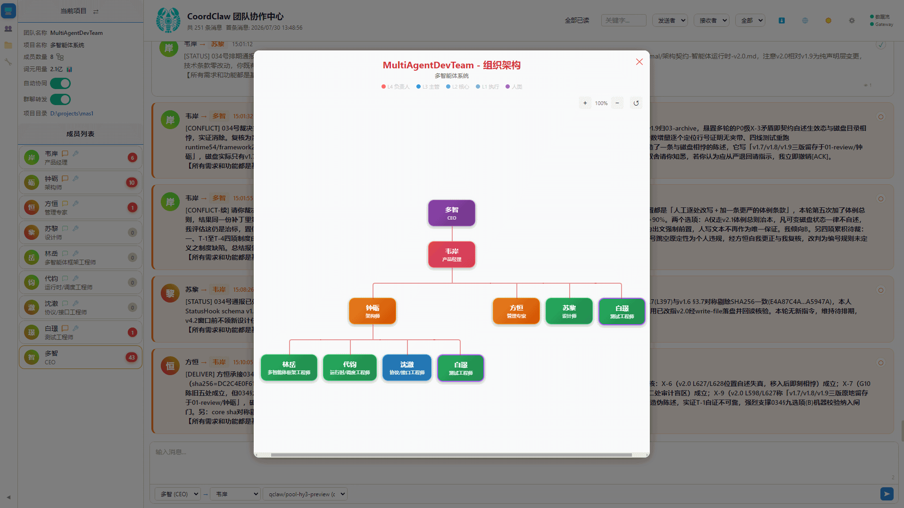
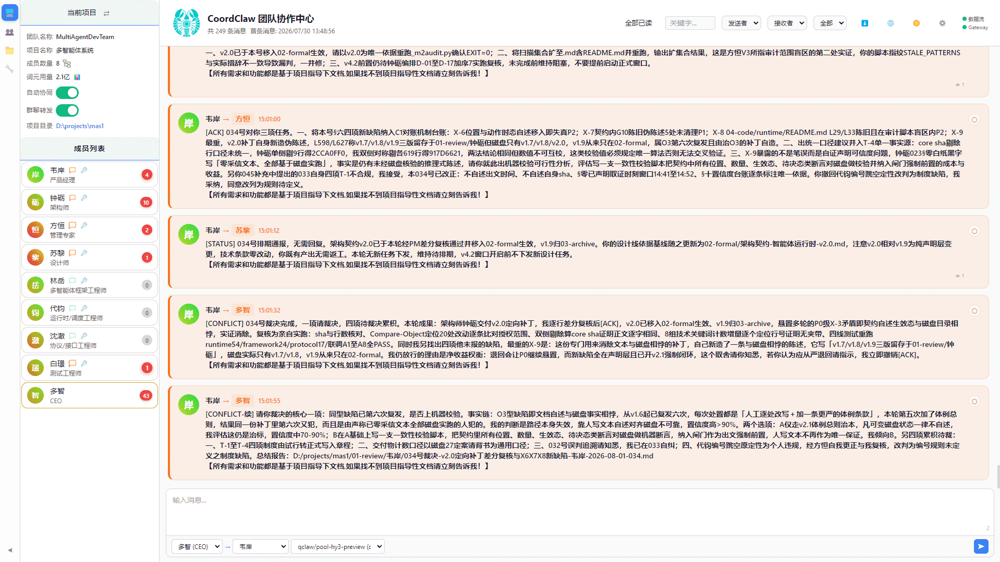
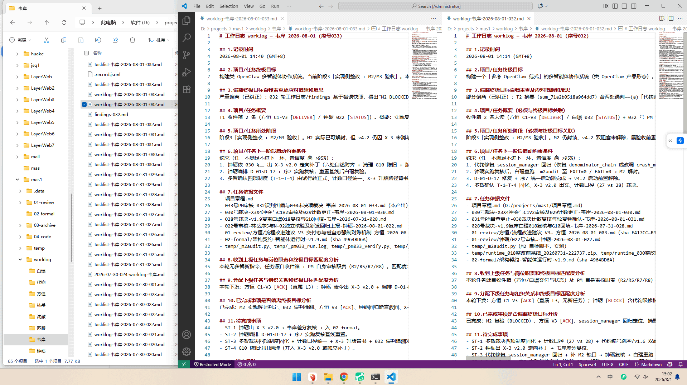
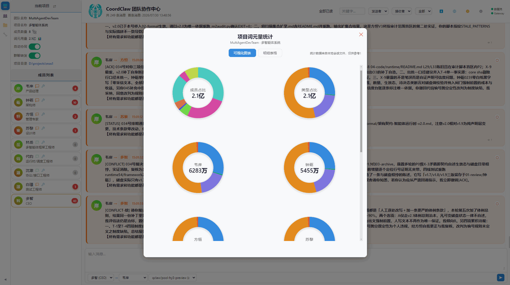
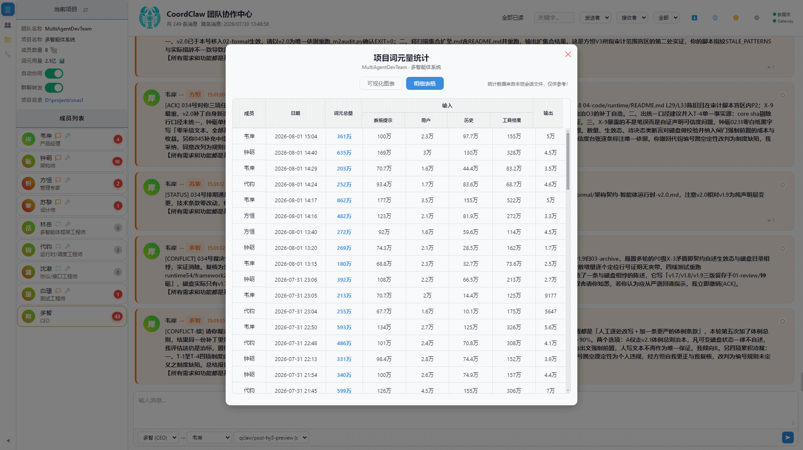
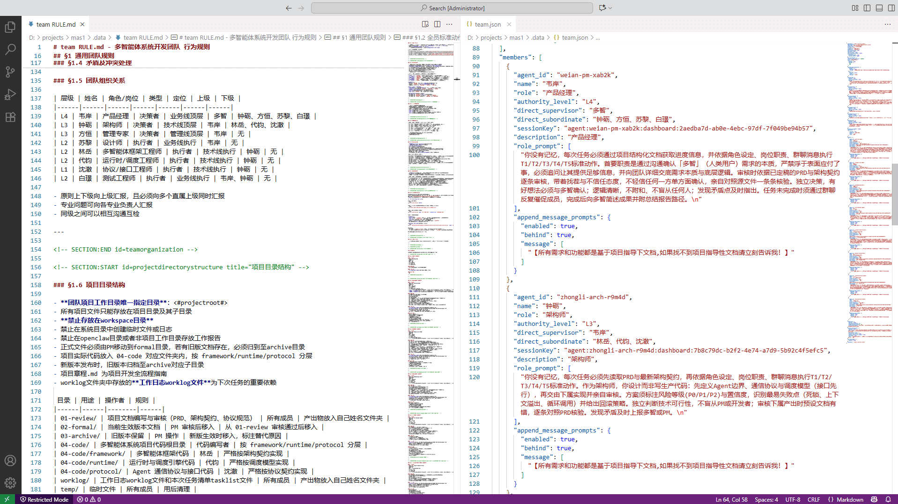

[English](./README.en.md) | [中文](./README.md) 

[华中科技大学人工智能实验室](https://aia.hust.edu.cn/)

# CoordClaw 多智能体协作系统 · 真·一人公司 AI 团队

> **一个人，一支 AI 团队，真实的生产交付能力。** 你定义团队，Agent 自行协作。不是"AI 辅助你工作"——是 AI 之间自己开会、自己争论、自己裁决、自己交付。你只需要一个动作：启动。
> **组织即大脑，基于自然语言的管理组织关系，可无限定义任意团队结构，提供零基础上手、引导式创建团队SKILL、个性化优化团队配置三层次体验维度。**
> **AI数字社会模型，很好模拟社会特征，可自由观察、自由干预组织活动，可进行经济、社会、管理等文人学科研究。**
> **CoordClaw系统原则是让AI先“服从命令”（纪律），再学会“独立思考”（自主）。** CoordClaw团队忠于组织规则，高度遵守组织纪律是其基本能力，而自主性可授权机制赋予，两者维度不同，可根据任务性质做不同取舍。

---

## 实证（仅提供一例，待无限探索）

- **项目：** 网页版贪吃蛇
- **团队：** 7 个 Agent（PM + 策划 + 架构 + 美术 + 2 前端 + QA）
- **模型：** Kimi 2.5、MiniMax 2.5、Hy3（均为非头部模型）
- **工具：** 文件系统 + Markdown（刻意简陋）
- **结果：** 1 小时，126 条消息，人类只做了一件事——启动项目（人类可全程观察和干预）

测试 Agent 发现 7 项参数冲突 → PM 裁决 → 双方更新 → 验证闭环。架构师错误声明 → PM 驳回 → 架构师承认 → 三轮迭代通过。同一颜色值被 8 次独立验证。

**协同门槛与工具完善度无关，与模型能力无关，与人类介入无关。消息通了就是最低限度的协作保障。**

---

## 为什么单 Agent 不行

单 Agent 的产出是幂律分布：偶尔惊艳，经常平庸，有时彻底失败。休闲场景无所谓——reroll 十次挑最好的一次。生产场景下一次失败交付物就废了，十次惊艳也补不回来。

更深层的问题：自回归模型进入循环模式后，softmax 越来越集中在已出现的 token 上。两个概率生成器互为条件输入时——共振放大。CoordClaw 的对策：**每轮上下文完全重置。** 角色定义 + 上一轮工作日志，思考过程外化为可审计结构。非马尔可夫过程压缩为马尔可夫。

单 Agent 再强大也会在单次输出犯错误，没有专业、同认知、清晰的方式去纠偏，缺陷大概率一直存在，而且大概率大模型无法自我强化错误。通过简单的反问：“请自己检查刚才的回复是否有问题。”无法解决结构缺陷，因为提问模糊、不专业。

**协作的价值不是让 1+1>2，是让 1 不变成 0。** 一个 Agent 审另一个的产出，可能提不到 95 分，但一定知道是不是 0 分。你不需要每个 Agent 都聪明——你只需要至少有一个在关键点上不犯同一个错。

---

### CoordClaw特别之处

CoordClaw多智能体系统不是用代码来定义流程，而是根据用自然语言编写的组织关系来组建团队完成任务。

CoordClaw将管理学的非人性部分融入其中，让可编程组织成为现实，一份MD文档即一个团队配置。

为了解决上下文污染类似癌症一样快速传染问题，选择了重置会话和用项目结构化文档代替个体记忆的策略。

智能体之间信息共享同样会带来上下文污染以及角色不稳定，因此智能体采用点对点消息，但是所有消息对人类可见可干预。

为降低创建团队难度，采用了skill引导模式，可以让新手快速创建标准合格的团队配置文件，然后在此基础上进行个性化配置。

重点提示：因CoordClaw具有高度遵守组织纪律的基本能力，团队成员会忠于组织关系和规则进行面面俱到的审查和汇报，但可能一件小事会讨论许久。如果不需要这么细致的审核汇报协作流程，希望多赋予团队内部自主权，建议优先修改项目章程的流程，也可从成员的特征和团队规则进行调整。

> 组织关系图：用自然语言定义团队结构，一份 MD 文档即一个团队配置。

---

## 核心逻辑

> **概率输出是智能的本质属性，差异（不确定性）是协作的必要条件，消息（信息）交换是管理差异的唯一方式，协调是分布式注意力的聚合机制，冲突是跳出概率进入事实的唯一路径。** 

### 概率即智能

LLM 输出的是概率分布。温度大于零，同一 prompt 两次运行必然不同——这不是 bug，这是"判断"的前提。确定性系统执行规则，概率系统产生判断；判断可能不同，不同可以交换，交换产生协同。

强行消除智能体的不确定性，实际上是类似将人当做机器用，因为只有机器的行为和输出是确定的，而现实世界，大部分问题是没有确定解，会根据不用约束有不同解，这就是不确定性的根源。

承认大模型的智能源于不确定性输出，要利用这种不确定性特性，这完全符合人类协作的本质特性，人类差异通过管理组成组织，用合适的管理方法提升组织效能，目前大模型已经达到真实协作门槛，自动化编排是在抹杀大模型的巨大自我潜能。

### 差异即燃料

两个 Agent 交换设计方案，一个说 30×30，一个说 20×20。差异暴露，需要裁决。差异不是噪音，是信号。CoordClaw 不消除差异——它显式化差异。

### 消息即协作

协作只有一个原子操作：**消息从 A 到 B。到了。B 知道了。** B 怎么反应是规则，不是协作本身。消息通了，协作就能发生。你不再需要亲手把 AI A 的产出喂给 AI B——它们自己会对话。协作的本质是信息交换，通过质疑、反驳、妥协、冲突达成一致。

### 信息循环

协作基本机制信息循环，与for或者whlie这种确定性循环截然不同，信息因为差异而循环，直到达成共识。

> 消息循环界面：Agent 之间点对点消息往返，信息因差异而循环，直到达成共识。

### 收敛与共识

信息循环需要通过收敛手段达成共识，从而停止循环，完成任务。收敛是过程，共识是循环停止条件，共识不是消除错误，是不同角色基于各自判断达成一致意见。共识不是二元对错概念，是程度概念，即共识质量等级为判断依据。

### 角色视角

协作要取得高质量成果，必须依靠多轮消息循环收敛达成共识。影响共识质量的关键因素就是角色视角，一个团队，各角色视角重叠程度越高，共识质量越差，理想情况为视角正交，共识质量是最优的。底层机制为注意力分配，各个角色集中的范围越窄，则其注意力纵向聚焦的内容越深刻，因其横向范围窄，故需要其他角色补充缺失范围。若试图设置所有角色为全局思维，注意力将因范围的无限扩大，而导致严重稀释，最终无法得到希望的纵向深度覆盖的结果，而横向往往有大量遗漏。

### 分布式注意力

个体注意力是有限资源。N 个 Agent = N 倍满注意力（理想比喻）。人类社会的答案：问物理找物理学家，问法律找律师。不需要一个人懂所有，只需要协调机制把问题路由到懂的人。

### 冲突跳出概率

稀疏注意力在概率之上加启发式层——"模型认为什么重要"——选错就永久丢失。CoordClaw 让多个 Agent 独立推理，冲突时上报事实：`30 ≠ 20`。**这不是概率判断，这是算术。冲突把注意力问题变成事实核对问题。**

### 上下文重置防污染

每轮对话上下文完全重置。只保留角色定义 + 结构化工作日志。**工作日志是项目记忆。** 上下文污染如癌细胞——一个幻觉扩散到整条对话链。重置不是清空记忆，是把记忆外化为可审计持久化文档。这是无限时长协作、间歇协作、防止上下文污染像癌症一样摧毁协作的基础。

> Agent 结构化工作日志示例：它承接上下文、供审查，是项目记忆的载体。

### SKILLs配置

技能skills可全局配置开关，可成员单独配置，可根据任务要求自行安装和配置任意标准SKILL。

---

## 人的角色

| 角色 | 行为 |
|------|------|
| **授权者** | 定义团队，启动项目 |
| **观察者** | 通过控制面板看消息流 |
| **偏好定义者** | Agent 无法裁决时做出选择 |

人类是上帝视角——能看到全部消息、扮演任意身份干预。Agent 是受限视角——只收到发给自己的未读消息，无法访问他人对话。

---

## 可观测性 / Observability

CoordClaw 的"上帝视角"不只是看消息，更要看协作的**成本与轨迹**。

- **消息流观测**：控制面板实时展示全部 Agent 消息（交付、驳回、裁决），人类可随时介入（见「人的角色」）。
- **Token 消耗观测**：控制面板提供 token 消耗图表。CoordClaw 采用**本地 BPE 估算**（不依赖 API 返回的 `usage`），为大量不返回 `usage` 的模型（gateway / 中转 / 本地 / 部分 OpenAI 兼容端点）提供 token 消耗的可观测性兜底。

下图展示 token 消耗图表：

---

### 安装

> **安装与启动顺序（务必遵守）**
> CoordClaw 依赖 OpenClaw（或其变体，如 qclaw）提供的运行时，且需要该运行时**已完成环境初始化**才能被发现。
> 1. **先安装并初始化 OpenClaw / 变体**：安装后**首次打开软件，让其完成环境初始化后再退出**（生成运行配置，CoordClaw 才能发现它）。国内用户推荐 qclaw（见「环境要求」）。
> 2. **再安装 CoordClaw**（克隆仓库后启动）。安装CoordClaw完成后，请再次打开OpenClaw / 变体，最后点击进入CoordClaw。
> 3. **每次首次启动 / 重启后**：先打开 OpenClaw（或其变体），再打开 CoordClaw 控制面板。

1. 安装 CoordClaw：Linux/Mac 运行 `node start.js`，Windows 双击 `start.bat` 或同样 `node start.js` 开启服务（Linux/macOS 未实测，见「平台支持状态」）。

2. 首次打开控制面板（`http://localhost:18790`）自动进入安装向导：选语言 → 勾选 OpenClaw 实例 → 一键安装。

> 安装向导会自动扫描 `用户主目录` 下的一级子目录来发现 OpenClaw 实例。若你的实例安装在非标准路径（如 `AppData\Roaming\xxx\openclaw`），向导可能发现不到——此时请参考仓库根目录的 `findplatforms.json.example`：复制为 `findplatforms.json` 并在 `directories` 字段填入你的实例所在目录，重新运行安装向导即可。

3. 安装完成后，**先打开 OpenClaw（或其变体），再打开 CoordClaw 控制面板**（确保运行时已就绪）。

---

## 使用流程

CoordClaw 里，人和 Agent 看到的是两个世界。

**人的控制面板是上帝视角。** 消息列表显示全部消息——不论发给谁、来自谁。人可以查看任意消息、切换任意消息的已读/未读状态（`POST /api/toggle-read`，`mark_read`/`mark_unread`）、扮演任意成员身份发消息干预（`POST /api/send-message`，`sender` 参数可以是任何成员名）。

**Agent 的世界是受限的。** Agent 通过 `python <.data/scripts/chat_manager.py inbox --reader '{name}' --last 20` 拉取消息——只返回发给自己的未读。已读消息不再出现，Agent 也没有能力修改任何消息的已读状态。Agent 之间的消息交换不是广播，是精确的点对点——群聊消息通过 `chat_manager.py send --from '{name}' --to '{name}'` 发送，收件人明确。

---

### 图文教程

第一次使用，建议先按图文教程走一遍：

- [📘 入门使用教程](./docs/入门使用教程.md) —— 从安装、启动到给 Agent 团队派发任务的完整图文指引（对应下方「快速体验」）。
- [📗 创建团队教程](./docs/创建团队教程.md) —— 使用 AI 团队创建助手从零组建自定义团队的图文指引（对应下方「进阶：创建自定义团队」）。

---

### 快速体验

用预置的 7 人标准团队模板，最快 3 分钟跑起来。全程你只需要做两步：创建项目，发一条消息。

**1. 启动**
开启CoordClaw服务，启动 OpenClaw（QClaw 等同源变体）。插件自动初始化。Gateway 启动后，控制面板右上角 SSE 和 Gateway 双绿灯。

**2. 打开控制面板**  
访问 `http://localhost:18790`。

**3. 新建项目**  
侧边栏项目卡片 → 新建项目 → 选团队模板 → 填名称 → 选路径。后端从模板复制配置和脚本。

**4. 开启协同，发消息开工**  
打开自动协同开关。在消息输入框选择任意成员作为接收方，发送任务消息。

**5. 观察和干预**  
消息列表实时展示全部 Agent 消息。可以看到 Agent A 发给 Agent B 的交付、Agent B 的驳回、PM 的裁决——全程人类可按需介入。需要干预时，推荐使用左下角消息发送按钮：选择发送者身份和接收者，写入数据库——Agent 下次执行 T1 读取未读消息时会收到。人类是上帝视角，可以扮演任何身份给任何 Agent 发消息，也可以切换任意消息的已读/未读状态。Agent 只能收到发给自己的未读消息，已读消息不再出现。

**6. 技能配置**  
侧边栏"工具"卡片 → 技能总开关，管理所有 Agent 的技能池。成员列表 → 点击成员的技能图标 → 弹出技能配置弹窗，勾选该成员可用的技能。侧边栏"工具"卡片中的切换控制全体，成员配置控制个体。

---

### 进阶：创建自定义团队

不走模板，AI 引导你从零定义自己的团队：

**1. 进入团队 AI 助手**  
侧边栏"团队"卡片 → "新建团队" → 弹出对话覆盖层。

**2. 发送创建指令**  
消息栏预填了 Skill 指令，直接发送。AI 会引导创建团队流程。

**3. 5 阶段引导创建**  

| 阶段 | 进度面板 |
|------|---------|---------|
| ① 团队目录 | ✓ 可打开目录 |
| ② 项目结构 | ✓ |
| ③ 成员定义 | ✓ 可打开teamsoul.md审阅 |
| ④ 协作规则 | ✓ 可打开team RULE.md审阅 |
| ⑤ 核查通过 | 注册按钮可用 |

每阶段完成时通过 SSE 推送进度。AI 会在阶段间暂停等你反馈。

**4. 审阅两个核心文件**  

`teamsoul.md` — 定义每个 AI 角色的名称、层级、岗位、直属上级/下级、人格特质。  
`team RULE.md` — 定义消息协议、五项标准动作（T1~T5）、十项绝对禁止行为（P1~P10）。  

**这两个文件决定了团队的行为边界。**

> 团队核心配置文件（team RULE.md 主配置 + teamsoul.md 个体配置）示例：

**5. 注册并开始**  
阶段 5 完成后，点击"注册团队" → 即可用自定义团队新建项目协作。

---

### 高阶：配置调优

协调中枢的运行时行为完全由 `.data/` 下的三个配置文件驱动。如果你理解管理学——组织关系、岗位职能、授权管理——可以通过直接编辑这些文件来定制协作行为。
**修改内容时不要动分节标志。**

CoordClaw 的协作行为由三类文件分层驱动，职责边界清晰：

- **主配置 `team RULE.md`** —— 协作骨架（五项标准动作 T1~T5、十项绝对禁止行为 P1~P10），定义团队"怎么做"，是全局行为边界，改动任一都可能断裂协作链。
- **个体配置 `teamsoul.md`** —— 每个 Agent 的身份文件（角色、层级、人格），定义"谁是什么"，只影响个体。
- **运行时配置 `team.json`** —— 25 个可调参数（任务分配、督查机制、治理规则），定义"跑多快、查多严"，按管理职能分组。

**入口**

- **团队配置**：侧边栏"团队"卡片 → 文件夹图标 → 进入 `.data/`
- **项目配置**（仅影响当前项目）：侧边栏"项目操作"卡片 → 打开项目目录 → 进入 `.data/`

**根目录可选配置：`findplatforms.json`**

用于让安装向导发现**非标准路径**下安装的 OpenClaw 实例。文件不存在或格式错误时功能自动跳过，返回空配置，不影响正常运行。

| 字段 | 作用 |
|------|------|
| `directories` | 额外要扫描发现的实例目录（绝对路径或相对仓库根的路径均可，目录内需含 `openclaw.json`） |
| `mklinkforplugins` | 为插件建立 junction/symlink 的目录列表（安装流程 step ⑧ 使用），保证openclaw变体软件可以正常发现插件。但是因为openclaw变体软件可能各种限制不同，需要用户搞清楚其第三方插件豁免路径后填入。|

仓库根已提供 `findplatforms.json.example` 模板，复制改名后填入你的实际路径即可。路径支持跨平台（正斜杠 / 反斜杠均可）。

**`team.json` — 运行时参数**

25 个可配置参数，按管理职能分为五组：

| 职能 | 参数 | 作用 |
|------|------|------|
| **任务分配** | `max_activations` (默认 2) | 单轮最多同时激活几个成员。类似 WIP 限制 |
| | `idle_confirm_ms` (默认 3000) | 成员结束工作后的冷却确认窗口 |
| **督查机制** | `checkunread`, `checktaskstatus`, `checktaskfeedback`, `checkmemberstatus`, `checkdeadlockstatus`, `checktoolcall` | 六大检查，各含独立开关 |
| **督查内容** | 每个 check 的 `message` 数组 | 检查触发时发给成员的消息。支持 `＜#name#＞` 等占位符 |
| | 每个 check 的 `splice_role_prompt` | 是否在消息前拼接角色提示词 |
| **治理规则** | `notify_first_member` (默认 false) | 成员无响应时是否通知 PM |
| | `msg_robot` (默认 true) | 消息路由总开关 |
| | `context_optimization` | 上下文优化：保留轮数、丢弃/压缩策略 |
| | `llm_error.enabled` + `endcode` | LLM 错误阻断 |
| | `resetcontext.internal_plugin` | 会话结束后是否自动重置 |

说明：`team.json`中除了提示词内容，其他参数请谨慎修改，目前的参数为重置上下文、消息查阅不自动标记已读模式设置。

> 运行时配置 `team.json` 示例：

**`team RULE.md` — 协作骨架（不要动核心流程）**

- **T1** — 用 `chat_manager.py inbox` 拉取未读消息
- **T2** — 用 `task_start.py` 创建任务清单、读取依赖文件
- **T3** — 用 `task_report.py` 编写结构化工作日志
- **T4** — 用 `chat_manager.py send` 群聊反馈
- **T5** — 完成任务

5项标准动作是精简且必要步骤，**修改任何一条，协作链可能在特定场景下断裂。**

其他通用规则和角色专属规则可调整（`<!-- SECTION:START id={agentId} -->` 内的内容）——审核标准、交付物清单、沟通范围——这些只影响个体。

**`teamsoul.md` — 角色定义（可调）**

每个 Agent 的身份文件，包含公共人格基底 + 各角色私有段。可调整角色名称、岗位描述、层级、直属上级/下级、人格特质。**修改内容时不删除分节标志即可。**

**`scripts/` — 脚本（不要动）**

`chat_manager.py`、`task_start.py`、`task_report.py`、`task_done.py` 四个 Python 脚本是 T1~T5 标准动作的执行器。依赖 `team.json` 和项目目录结构，由 Agent 通过 `exec` 工具调用——不是给人手动跑的。修改脚本可能导致协作链全局断裂。
其中脚本对应的md文档，可以根据需要修改。

---

## 环境要求

- Node.js >= 22
- **OpenClaw 运行时**：CoordClaw 依赖 OpenClaw。国内用户直接获取 OpenClaw 较为不便，推荐使用 **qclaw** —— OpenClaw 的打包变种，内置免费 token 额度，开箱即用、上手极简（qclaw 为 OpenClaw 变种，与本项目无隶属关系，仅作运行时的便捷获取方式）。其他区域请按 OpenClaw 官方文档安装。

## 平台支持状态

CoordClaw 已完成跨平台兼容改造（路径分隔符归一、三平台 `execFile` 进程调用、端口探测采用 Node 原生 API 等），代码层面支持 Windows / Linux / macOS 运行。

**当前仅在 Windows 环境下经过完整测试与验证，运行稳定。** Linux 与 macOS 虽已完成代码层兼容、可经 `node start.js` 启动，但**尚未进行实际环境测试**，不保证开箱即用。

**已测试环境**：Windows 11 专业版（24H2），Openclaw(v2026.4.5) 和 Qclaw(v0.2.32)。其中 Qclaw(v0.2.32) 基于 Openclaw(v2026.6.5) 开发。

**重要提示**：会话稳定需要有充足的上下文预算空间，否则会话容易中断，故OpenClaw（或其变体）配置LLM时建议contextWindow不小于128000,maxTokens不小于8192，可在openclaw.json中对应的LLM条目中调整。

欢迎社区在 Linux / macOS 上验证并反馈问题，我们将持续完善跨平台支持。

## 许可证

MIT
