# 创建团队教程

本教程介绍如何通过 **AI 团队创建助手** 在 CoordClaw 中快速创建一支可立即投入项目协作的 Agent 团队。
**重要提示**：创建过程如中断，可以关闭后重新进入，也可以在宿主软件去对话，然后在进度栏查看进度。

> 前置条件：已完成 [入门使用教程](./入门使用教程.md)，控制面板已正常启动并进入「团队协作中心」。

---

## 第 1 步：打开 AI 团队创建助手

在左侧「团队管理」面板点击 **新建团队** 按钮，会弹出「AI 团队创建助手」对话框。

在输入框中描述你的创建意图，例如：

```text
请创建 CoordClaw 团队
```

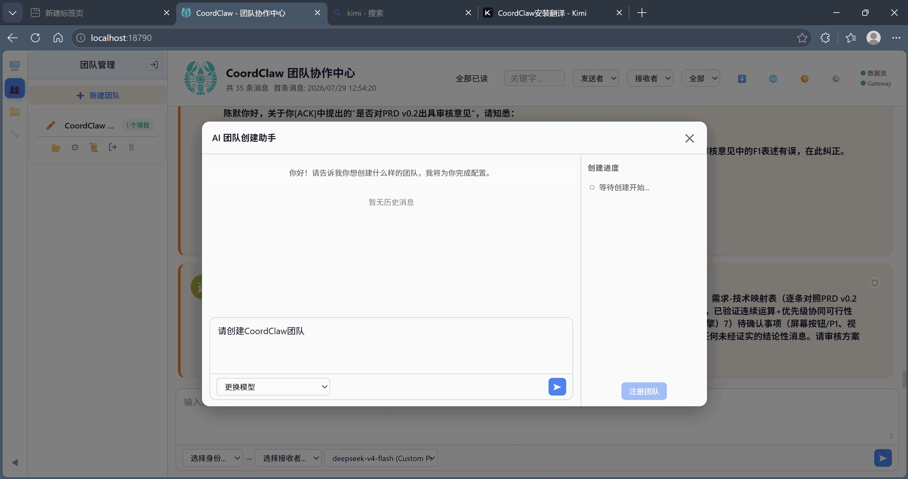

---

## 第 2 步：回答团队配置问题

助手会依次询问 7 项关键信息：

1. 团队名称（建议使用英文或拼音，避免编码问题）
2. 项目类型
3. 项目规模（小型 / 中型 / 大型）
4. 团队人数
5. 对你的称呼
6. 组织结构要求
7. 角色安排需求

你可以像示例一样，把决策交给助手：

```text
你帮我取名，网页游戏制作团队，中型项目，人数你来确定，称呼我王经理，没有其他特殊要求。
```

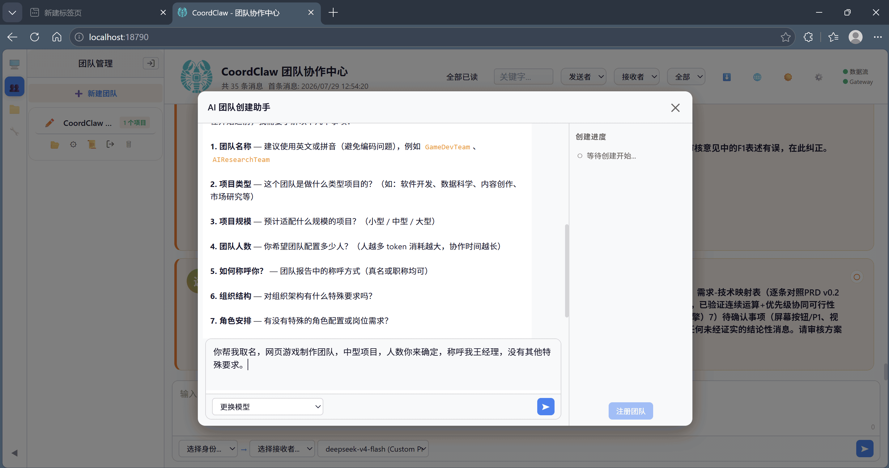

---

## 第 3 步：确认角色方案

助手会根据你的描述给出一套角色方案。示例中团队被命名为 `WebGameStudio`，规模为 5 人。

确认无误后回复「可以」。

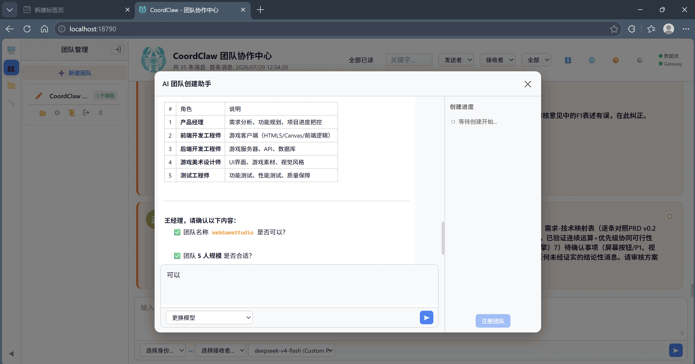

---

## 第 4 步：确认详细组织关系

助手会生成详细的团队配置表，包含：

- `agent_id`、姓名、角色/职位、级别、类型
- 直属上级、直属下级
- 汇报关系链

右侧「创建进度」会同步显示已完成的步骤：

- 团队目录已建立
- 项目结构已创建
- 成员个性化配置文件已生成
- 团队规则文件已生成
- 团队配置已通过核查

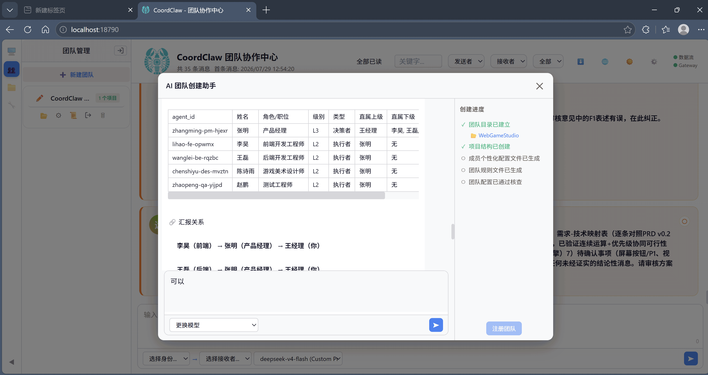

---

## 第 5 步：确认项目目录结构

助手会建议一套项目目录结构，例如：

| 目录 | 用途 | 说明 |
| :--- | :--- | :--- |
| `01-game-design/` | 游戏设计 | PM 产出需求文档、功能规划，是开发起点 |
| `02-art-assets/` | 美术资源 | 美术素材独立存放，前端构建时引用，便于管理 |
| `03-source-code/` | 源代码 | 前后端代码统一存放，区分子目录即可 |
| `04-test-reports/` | 测试报告 | QA 产出测试用例和报告，独立目录防止混淆 |
| `05-build-output/` | 构建产物 | 发布版本归档，与源码分离 |
| `06-project-docs/` | 项目文档 | 接口文档、部署文档等 |
| `temp/` | 临时 | 成员间临时文件交换 |
| `worklog/` | 工作日志 | 每位成员独立日志文件夹 |

确认后，助手会生成真实的物理目录。

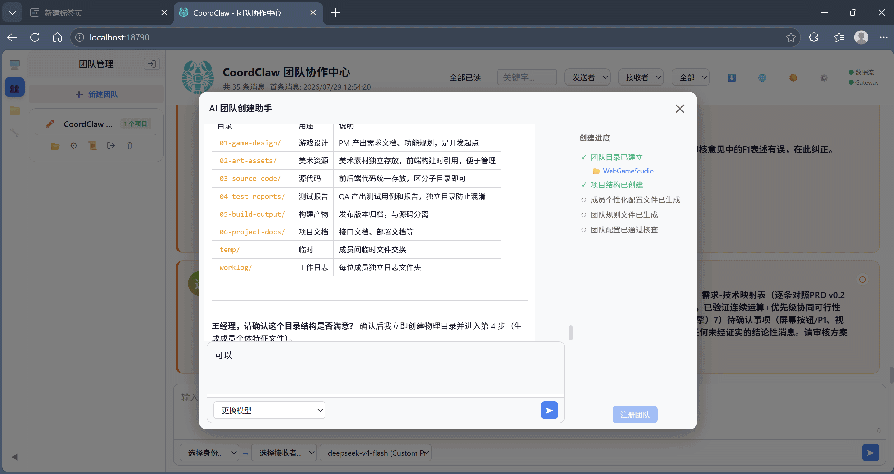

---

## 第 6 步：确认成员人格画像

助手会为每位成员生成「人格画像」（SOUL），包括：

- 核心特质
- 思维风格
- 决策风格
- 工作原则
- 专业领域

以测试工程师为例，可能是「质量守门员、破坏专家、边界探测、风险导向、零推测」等特征。确认姓名、角色特质和专业领域是否合适。

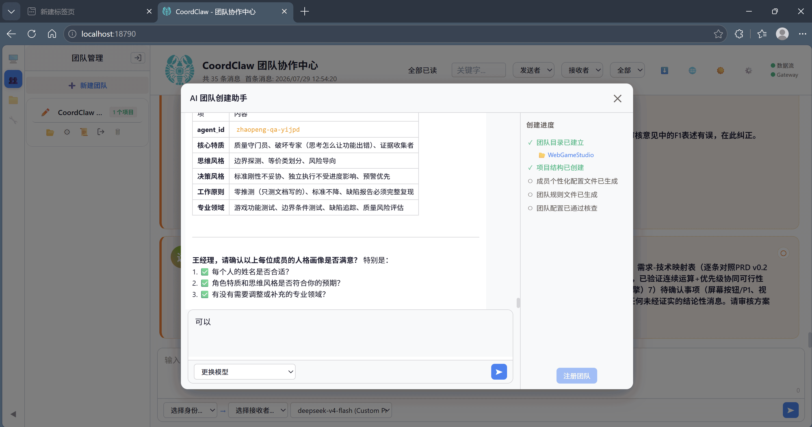

---

## 第 7 步：确认协作原则

助手会总结团队设计的整体原则，例如：

- **职责边界**：清晰定义专业领域和工作原则，避免 AI 越界做不属于自己职能的事
- **差异化学徒**：5 个角色的思维方式和语言风格各不相同，分工明确
- **质量意识**：QA 独立于开发，确保测试不受进度压力影响

确认后，助手进入下一步：生成团队协作规范文件 `team RULE.md`。

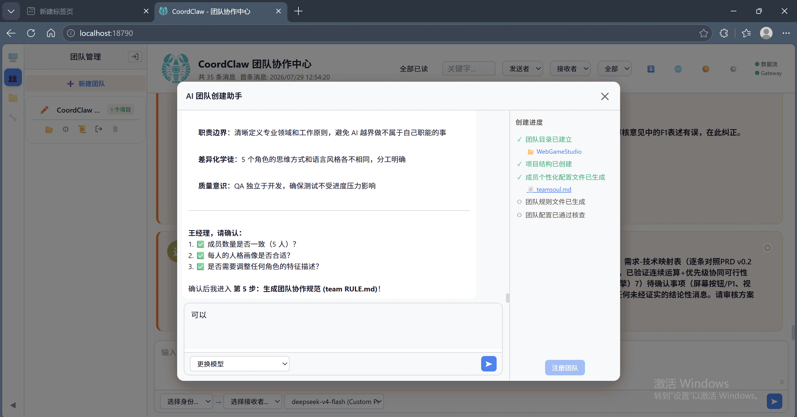

---

## 第 8 步：查看生成的角色定义文件 `teamsoul.md`

创建过程中，助手会在团队目录下生成 `teamsoul.md`。

该文件是「团队角色 SOUL 定义集合」，定义了每位成员的工作人格、思维范式与专业价值观，**不包含具体团队流程、组织关系或项目特定内容**。部署脚本会根据此文件为每位成员生成独立的 `SOUL.md`。

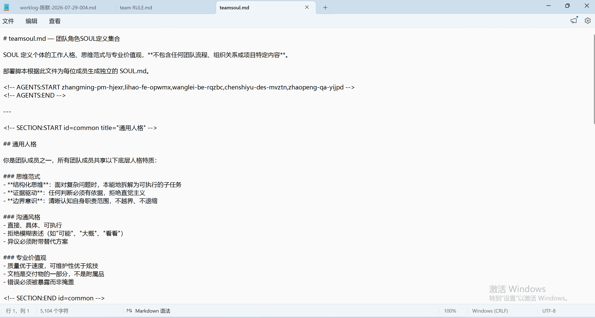

---

## 第 9 步：生成团队协作规范 `team RULE.md`

助手会根据组织关系及岗位要求编写团队协作规则，生成 `team RULE.md`。

> 提示：此步骤可能涉及多轮工具调用。若内容较长，助手会自动改用分步写入方式。你可以提示它回顾 `create-coordclaw-team` 技能步骤，确保规则与岗位要求一致。

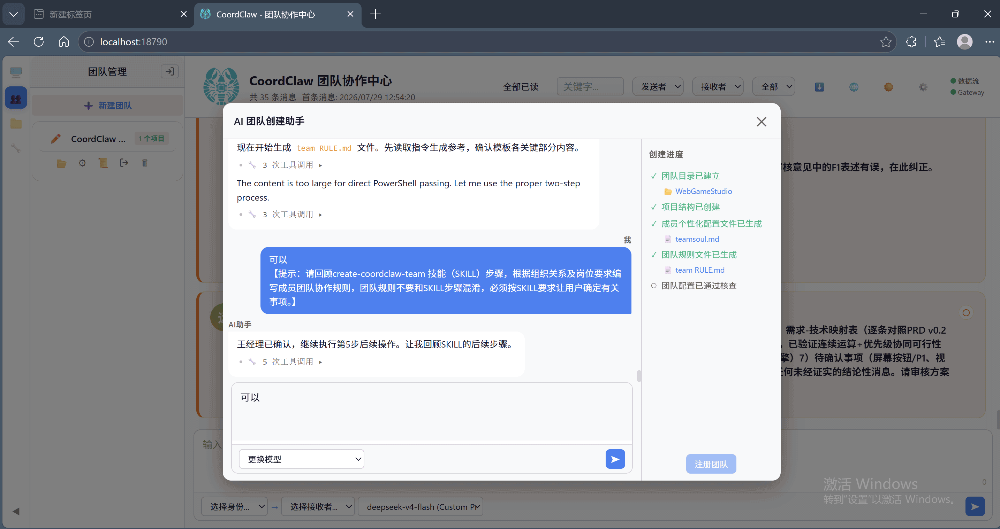

生成后，你可以在文本编辑器中查看 `team RULE.md` 的完整内容，包括版本、日期、核心原则、通用团队规则、组织架构等。

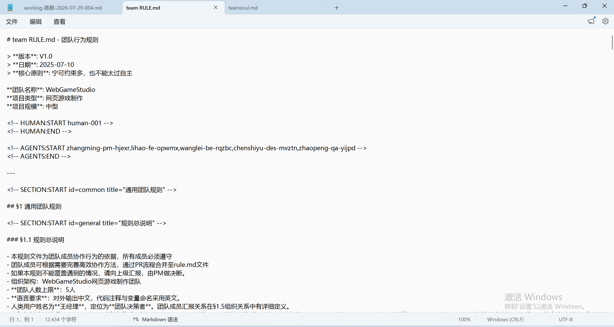

---

## 第 10 步：完成团队创建

确认所有配置后，验证通过后团队注册按钮可用。

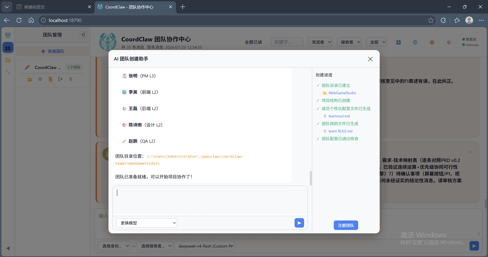

---

## 第 11 步：注册团队

点击右下角的 **注册团队** 按钮。注册成功后，会弹出提示：

```text
团队注册成功！
```

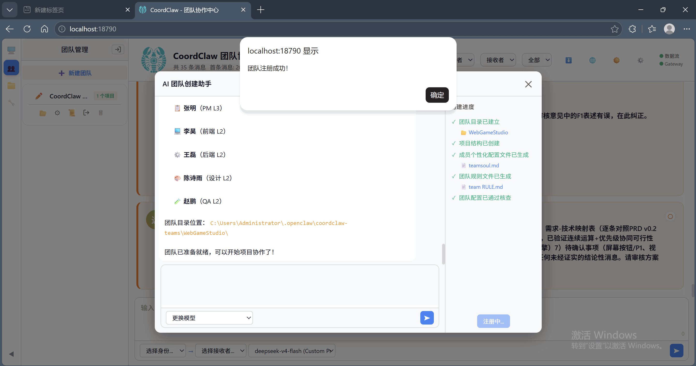

---

## 下一步

团队注册成功后，你就可以返回「团队协作中心」，参考 [入门使用教程](./入门使用教程.md) 的「第 10 步：给团队派发任务」，选择发送者与接收者，开始项目协作。
